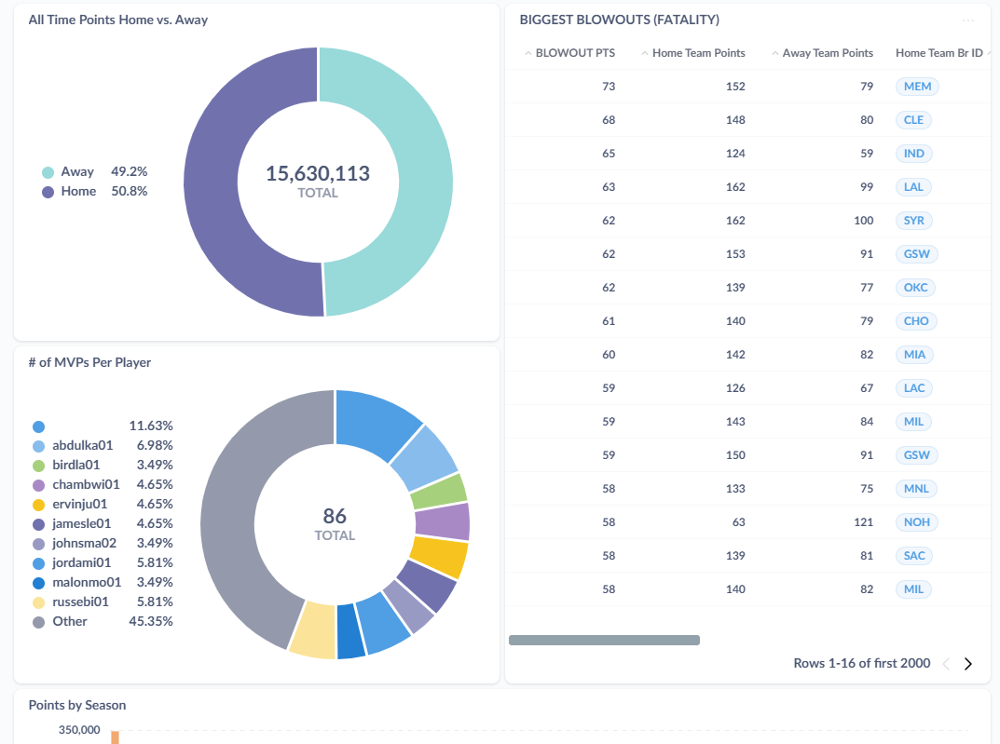

# StatBucket 2.0--Currently In Development

Scrape and store unlimited NBA Information!!

In any way ya like it.

A comprehensive system for scraping NBA data from basketball-reference.com.

## Goals

- To download and store all manner of NBA data for exciting analysis!!
- Seamless staging mechanism of data rows! In addition to the staging of table design changes automatically provided via django migrations.
- Highly modular and reusable scraping modules. Dangerous for scraping any website.

## Technical Design

- 2 Mariadb databases plus one small sqlite database to manage the django metadata.
  - 1 Mariadb instance is for staging data, the other is for production data. The table design should be identical unless new design changes are being tested in the staging database.
  - The database router well never allow you to apply the migrations to the wrong database.
- 2 apps.
  - "app" is the main app that contains the production data models.
  - "staging" is the staging app that contains the staging data models.

