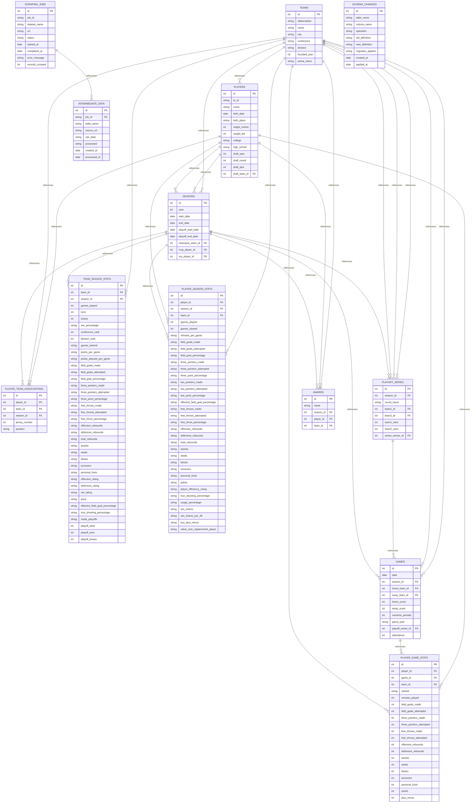

```mermaid
erDiagram
    SEASONS {
        int id PK
        int year
        date start_date
        date end_date
        date playoff_start_date
        date playoff_end_date
        int champion_team_id FK
        int mvp_player_id FK
        int roy_player_id FK
    }

    TEAMS {
        int id PK
        string abbreviation
        string name
        string city
        string conference
        string division
        int founded_year
        string arena_name
    }

    PLAYERS {
        int id PK
        string br_id
        string name
        date birth_date
        string birth_place
        int height_inches
        int weight_lbs
        string college
        string high_school
        int draft_year
        int draft_round
        int draft_pick
        int draft_team_id FK
    }

    GAMES {
        int id PK
        date date
        int season_id FK
        int home_team_id FK
        int away_team_id FK
        int home_score
        int away_score
        int overtime_periods
        string game_type
        int playoff_series_id FK
        int attendance
    }

    PLAYER_TEAM_ASSOCIATIONS {
        int id PK
        int player_id FK
        int team_id FK
        int season_id FK
        int jersey_number
        string position
    }

    TEAM_SEASON_STATS {
        int id PK
        int team_id FK
        int season_id FK
        int games_played
        int wins
        int losses
        string win_percentage
        int conference_rank
        int division_rank
        string games_behind
        string points_per_game
        string points_allowed_per_game
        string field_goals_made
        string field_goals_attempted
        string field_goal_percentage
        string three_pointers_made
        string three_pointers_attempted
        string three_point_percentage
        string free_throws_made
        string free_throws_attempted
        string free_throw_percentage
        string offensive_rebounds
        string defensive_rebounds
        string total_rebounds
        string assists
        string steals
        string blocks
        string turnovers
        string personal_fouls
        string offensive_rating
        string defensive_rating
        string net_rating
        string pace
        string effective_field_goal_percentage
        string true_shooting_percentage
        string made_playoffs
        int playoff_seed
        int playoff_wins
        int playoff_losses
    }

    PLAYER_SEASON_STATS {
        int id PK
        int player_id FK
        int season_id FK
        int team_id FK
        int games_played
        int games_started
        string minutes_per_game
        string field_goals_made
        string field_goals_attempted
        string field_goal_percentage
        string three_pointers_made
        string three_pointers_attempted
        string three_point_percentage
        string two_pointers_made
        string two_pointers_attempted
        string two_point_percentage
        string effective_field_goal_percentage
        string free_throws_made
        string free_throws_attempted
        string free_throw_percentage
        string offensive_rebounds
        string defensive_rebounds
        string total_rebounds
        string assists
        string steals
        string blocks
        string turnovers
        string personal_fouls
        string points
        string player_efficiency_rating
        string true_shooting_percentage
        string usage_percentage
        string win_shares
        string win_shares_per_48
        string box_plus_minus
        string value_over_replacement_player
    }

    PLAYER_GAME_STATS {
        int id PK
        int player_id FK
        int game_id FK
        int team_id FK
        string started
        int minutes_played
        int field_goals_made
        int field_goals_attempted
        int three_pointers_made
        int three_pointers_attempted
        int free_throws_made
        int free_throws_attempted
        int offensive_rebounds
        int defensive_rebounds
        int assists
        int steals
        int blocks
        int turnovers
        int personal_fouls
        int points
        int plus_minus
    }

    PLAYOFF_SERIES {
        int id PK
        int season_id FK
        string round_name
        int team1_id FK
        int team2_id FK
        int team1_wins
        int team2_wins
        int series_winner_id FK
    }

    AWARDS {
        int id PK
        string name
        int season_id FK
        int player_id FK
        int team_id FK
    }

    SCRAPING_JOBS {
        int id PK
        string job_id
        string dataset_name
        string url
        string status
        date started_at
        date completed_at
        string error_message
        int records_scraped
    }

    SCHEMA_CHANGES {
        int id PK
        string table_name
        string column_name
        string operation
        string old_definition
        string new_definition
        string migration_applied
        date created_at
        date applied_at
    }

    INTERMEDIATE_DATA {
        int id PK
        string job_id FK
        string table_name
        string source_url
        string raw_data
        string processed
        date created_at
        date processed_at
    }

    PLAYERS ||--o{ SEASONS : "references"
    PLAYERS ||--o{ SEASONS : "references"
    TEAMS ||--o{ SEASONS : "references"
    TEAMS ||--o{ PLAYERS : "references"
    SEASONS ||--o{ GAMES : "references"
    PLAYOFF_SERIES ||--o{ GAMES : "references"
    TEAMS ||--o{ GAMES : "references"
    TEAMS ||--o{ GAMES : "references"
    SEASONS ||--o{ PLAYER_TEAM_ASSOCIATIONS : "references"
    TEAMS ||--o{ PLAYER_TEAM_ASSOCIATIONS : "references"
    PLAYERS ||--o{ PLAYER_TEAM_ASSOCIATIONS : "references"
    SEASONS ||--o{ TEAM_SEASON_STATS : "references"
    TEAMS ||--o{ TEAM_SEASON_STATS : "references"
    SEASONS ||--o{ PLAYER_SEASON_STATS : "references"
    PLAYERS ||--o{ PLAYER_SEASON_STATS : "references"
    TEAMS ||--o{ PLAYER_SEASON_STATS : "references"
    TEAMS ||--o{ PLAYER_GAME_STATS : "references"
    GAMES ||--o{ PLAYER_GAME_STATS : "references"
    PLAYERS ||--o{ PLAYER_GAME_STATS : "references"
    SEASONS ||--o{ PLAYOFF_SERIES : "references"
    TEAMS ||--o{ PLAYOFF_SERIES : "references"
    TEAMS ||--o{ PLAYOFF_SERIES : "references"
    TEAMS ||--o{ PLAYOFF_SERIES : "references"
    SEASONS ||--o{ AWARDS : "references"
    PLAYERS ||--o{ AWARDS : "references"
    TEAMS ||--o{ AWARDS : "references"
    SCRAPING_JOBS ||--o{ INTERMEDIATE_DATA : "references"
```